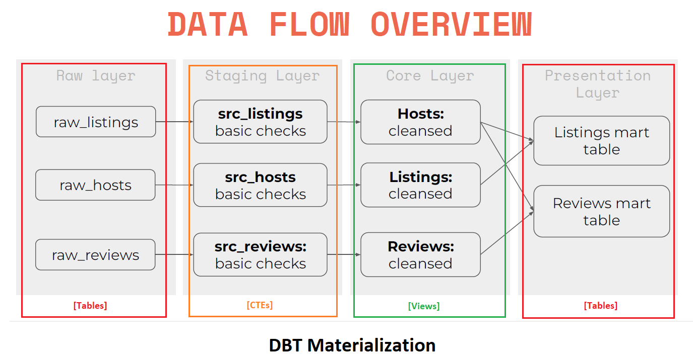
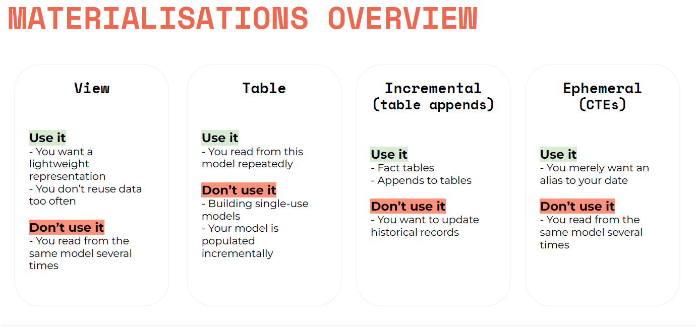

# ANALYTICS ENGINEERING WITH AIRBNB

Welcome to the Analytics Engineering project with Airbnb data. In this project, we will explore simulating the life of an Analytics Engineer at Airbnb. This involves tasks such as loading, cleansing, and exposing data, as well as writing tests, automations, and documentation.

● Simulating the life of an Analytics Engineer in Airbnb

● Loading, Cleansing, Exposing data

● Writing test, automations and documentation

● Data source: Inside Airbnb: Berlin


## Python Dependency Management using Poetry

We use Poetry for managing Python dependencies in this project. Poetry simplifies dependency management and ensures a consistent environment for your code.

Refer - https://python-poetry.org/docs/

## Using your virtual environment with Poetry

By default, Poetry creates a virtual environment in {cache-dir}/virtualenvs. You can change the cache-dir value by editing the Poetry configuration. Additionally, you can use the virtualenvs.in-project configuration variable to create virtual environments within your project directory.

## Activating the virtual environment
To activate the virtual environment, run the following command:

```python
poetry shell
```

## Deactivate  the virtual environment
To deactivate the virtual environment, you can use either of the following commands:

```python
exit
OR
deactivate
```

## Installing dependencies
To install project dependencies, run the following command:

```python
poetry install
```

## Project Overview
You can find a detailed project overview in the "Analytics_Engineering_with_Airbnb.pdf" document.

Here are a couple of images that provide an overview of the project:





## Snowflake Environment Setup

To set up the Snowflake environment, you need to create a user and configure roles and permissions. Copy the following SQL statements into a Snowflake Worksheet and execute them:

## Snowflake user creation
Copy these SQL statements into a Snowflake Worksheet, select all and execute them (i.e. pressing the play button).

```sql
-- Use an admin role
USE ROLE ACCOUNTADMIN;

-- Create the `transform` role
CREATE ROLE IF NOT EXISTS transform;
GRANT ROLE TRANSFORM TO ROLE ACCOUNTADMIN;

-- Create the default warehouse if necessary
CREATE WAREHOUSE IF NOT EXISTS COMPUTE_WH;
GRANT OPERATE ON WAREHOUSE COMPUTE_WH TO ROLE TRANSFORM;

-- Create the `dbt` user and assign to role
CREATE USER IF NOT EXISTS dbt
  PASSWORD='dbtPassword123'
  LOGIN_NAME='dbt'
  MUST_CHANGE_PASSWORD=FALSE
  DEFAULT_WAREHOUSE='COMPUTE_WH'
  DEFAULT_ROLE='transform'
  DEFAULT_NAMESPACE='AIRBNB.RAW'
  COMMENT='DBT user used for data transformation';
GRANT ROLE transform to USER dbt;

-- Create our database and schemas
CREATE DATABASE IF NOT EXISTS AIRBNB;
CREATE SCHEMA IF NOT EXISTS AIRBNB.RAW;

-- Set up permissions to role `transform`
GRANT ALL ON WAREHOUSE COMPUTE_WH TO ROLE transform; 
GRANT ALL ON DATABASE AIRBNB to ROLE transform;
GRANT ALL ON ALL SCHEMAS IN DATABASE AIRBNB to ROLE transform;
GRANT ALL ON FUTURE SCHEMAS IN DATABASE AIRBNB to ROLE transform;
GRANT ALL ON ALL TABLES IN SCHEMA AIRBNB.RAW to ROLE transform;
GRANT ALL ON FUTURE TABLES IN SCHEMA AIRBNB.RAW to ROLE transform;

```

## Snowflake data import

To import data into Snowflake, you can use the following SQL statements. Copy them into a Snowflake Worksheet and execute them:

```sql
-- Set up the defaults
USE WAREHOUSE COMPUTE_WH;
USE DATABASE airbnb;
USE SCHEMA RAW;

-- Create our three tables and import the data from S3
CREATE OR REPLACE TABLE raw_listings
                    (id integer,
                     listing_url string,
                     name string,
                     room_type string,
                     minimum_nights integer,
                     host_id integer,
                     price string,
                     created_at datetime,
                     updated_at datetime);
                    
COPY INTO raw_listings (id,
                        listing_url,
                        name,
                        room_type,
                        minimum_nights,
                        host_id,
                        price,
                        created_at,
                        updated_at)
                   from 's3://dbtlearn/listings.csv'
                    FILE_FORMAT = (type = 'CSV' skip_header = 1
                    FIELD_OPTIONALLY_ENCLOSED_BY = '"');
                    

CREATE OR REPLACE TABLE raw_reviews
                    (listing_id integer,
                     date datetime,
                     reviewer_name string,
                     comments string,
                     sentiment string);
                    
COPY INTO raw_reviews (listing_id, date, reviewer_name, comments, sentiment)
                   from 's3://dbtlearn/reviews.csv'
                    FILE_FORMAT = (type = 'CSV' skip_header = 1
                    FIELD_OPTIONALLY_ENCLOSED_BY = '"');
                    

CREATE OR REPLACE TABLE raw_hosts
                    (id integer,
                     name string,
                     is_superhost string,
                     created_at datetime,
                     updated_at datetime);
                    
COPY INTO raw_hosts (id, name, is_superhost, created_at, updated_at)
                   from 's3://dbtlearn/hosts.csv'
                    FILE_FORMAT = (type = 'CSV' skip_header = 1
                    FIELD_OPTIONALLY_ENCLOSED_BY = '"');

```

## Check DBT profile
To verify your DBT profile configuration, run the following command:

```python
dbt debug --config-dir
```

## DBT Profiles.yml
You can find your DBT profile configuration file at the following path:

Path url - ```%userprofile%\.dbt```

Here's an example of a DBT profile configuration:

```yml
dbt_airbnb_project:
  outputs:
    dev:
      account: [snowflke account id x-y]
      database: AIRBNB
      password: dbtPassword123
      role: transform
      schema: DEV
      threads: 1
      type: snowflake
      user: dbt
      warehouse: COMPUTE_WH
  target: dev
```

## Verify Snowflake Connection
Navigate to the DBT project directory and run the following command to verify the Snowflake connection:

```python
cd dbt_airbnb_project
dbt debug
```

## Add Seeds to your DAG
Seeds are CSV files in your dbt project (typically in your seeds directory), that dbt can load into your data warehouse using the dbt seed command.

Seeds can be referenced in downstream models the same way as referencing models — by using the ref function.

Download the CSV from the following S3 location: https://dbtlearn.s3.us-east-2.amazonaws.com/seed_full_moon_dates.csv

Then place it to the seeds folder.

Now to apply seed, run the following command:
```python
dbt seed
```

This will result into `AIRBNB.DEV.SEED_FULL_MOON_DATES` table in snowflake

## Add sources to your DAG

Sources make it possible to name and describe the data loaded into your warehouse by your Extract and Load tools. By declaring these tables as sources in dbt, you can then

select from source tables in your models using the {{ source() }} function, helping define the lineage of your data
test your assumptions about your source data
calculate the freshness of your source data

### Declaring a source
Sources are defined in .yml files nested under a sources: key.

To configure sources to snapshot freshness information, add a freshness block to your source and loaded_at_field to your table declaration:

sources.yml

```yml
version: 2

sources:
  - name: airbnb
    database: airbnb
    schema: raw
    tables:
      - name: listings
        identifier: raw_listings

      - name: hosts
        identifier: raw_hosts

      - name: reviews
        identifier: raw_reviews
        freshness:
          warn_after:
            count: 1
            period: hour
          error_after:
            count: 24
            period: hour
        loaded_at_field: date
```

### Checking source freshness
To snapshot freshness information for your sources, use the dbt source freshness command :

```python
dbt source freshness
```

## Add snapshots to your DAG
Run the following command:

```python
dbt snapshot
```

## Add tests to your DAG
Tests are assertions you make about your models and other resources in your dbt project (e.g. sources, seeds and snapshots). When you run dbt test, dbt will tell you if each test in your project passes or fails.

There are two ways of defining tests in dbt:
- singular (custom sql scripts)
- generic (build-in tests or macros)

Run the following command:
```python
dbt test
```

```python
dbt test --select <model name>
```

```python
dbt test --select <test name>
```

## About documentation
dbt provides a way to generate documentation for your dbt project and render it as a website. 

## Adding descriptions to your project
To add descriptions to your project, use the description: key in the same files where you declare tests, i.e. in schema.yml file

## Generating project documentation
You can generate a documentation site for your project (with or without descriptions) using the CLI.

Run the following command:
```python
dbt docs generate
dbt docs serve
```

If you receive below error:
`OSError: [WinError 10048] Only one usage of each socket address (protocol/network address/port) is normally permitted`

Then run following command in the Command Prompt window (where <PID> is the PID that needs to be killed):

Look at the last column in the results - the PID.
```cmd
netstat -ano | findstr ":80"
```

kills the task:
```cmd
taskkill /PID <PID> /F
```

Now return the dbt docs commands.